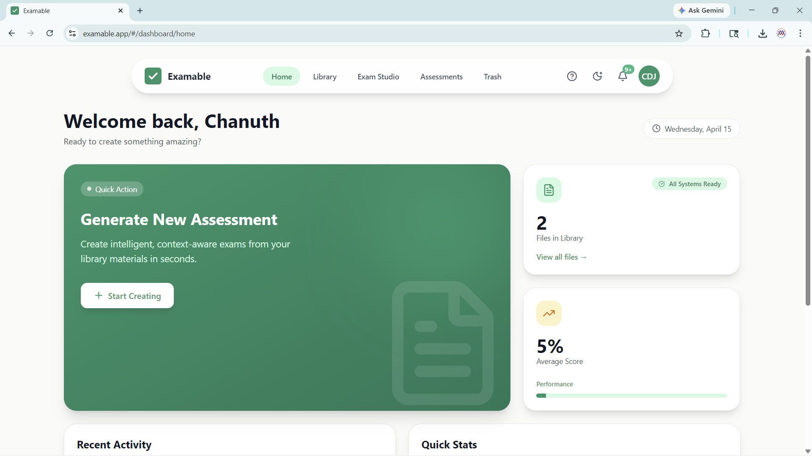
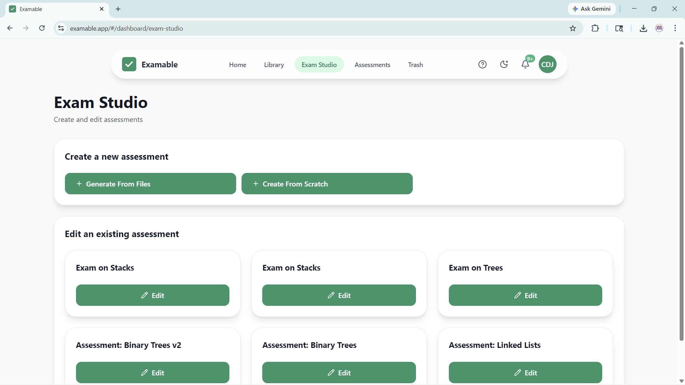
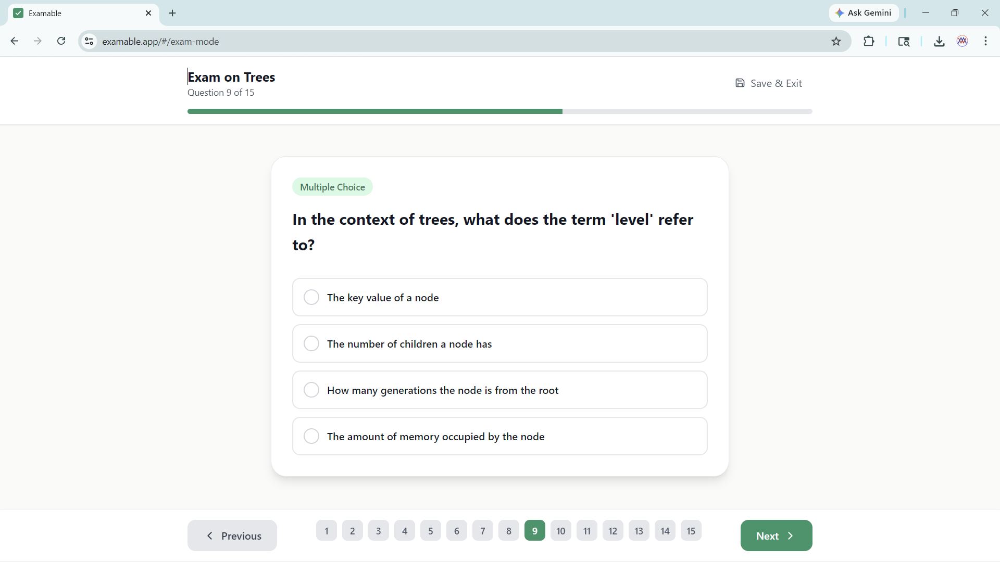
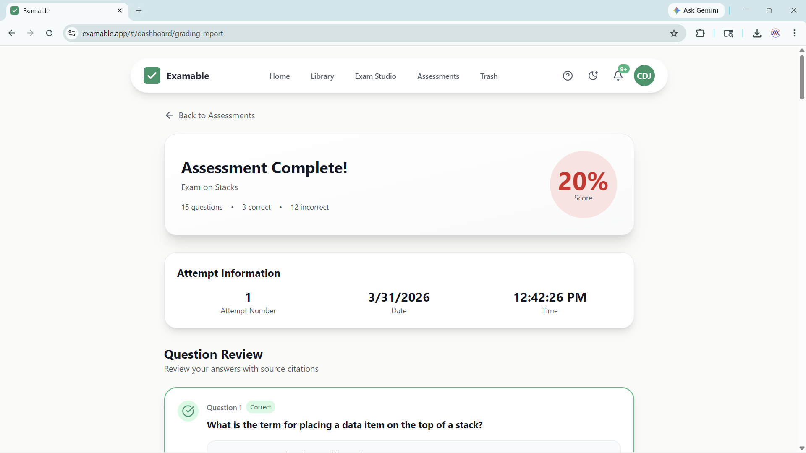
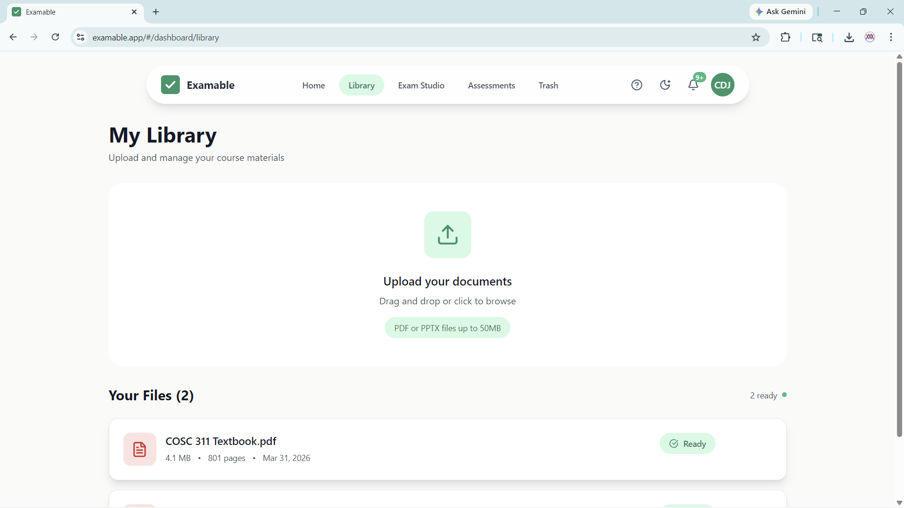
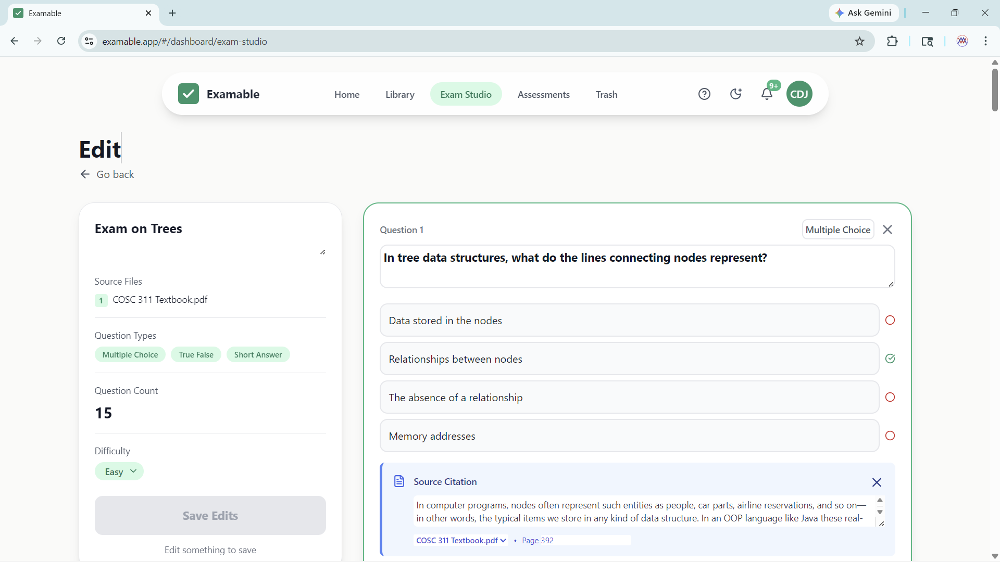
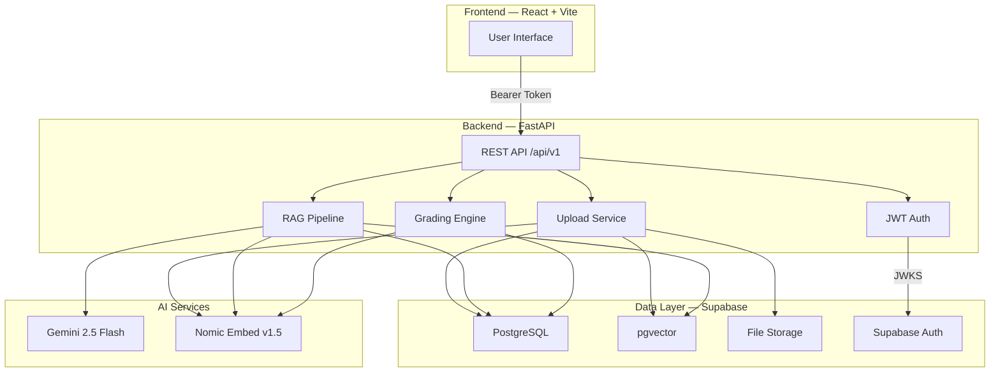

<p align="center">
  
</p>

<h1 align="center">Examable — AI Assessment Platform</h1>

<p align="center">
  <em>Upload your study materials. Get AI-generated exams in seconds.</em>
</p>

<p align="center">
  
  
  
  
  
  
</p>

<p align="center">
  <a href="https://www.examable.app">🌐 Live Demo — www.examable.app</a>
</p>

---

## 🎯 About

Examable is a full-stack educational platform that uses **Retrieval-Augmented Generation (RAG)** to transform study materials into context-aware assessments. Upload a PDF or PowerPoint, specify your topics, and the AI generates exams grounded in your actual content — not hallucinated facts.

### Key Features

- **📄 Multi-format Upload** — PDF and PPTX support with automatic text extraction, chunking, and vector embedding
- **🧠 RAG-Powered Generation** — Questions are generated from your actual documents using semantic retrieval + Gemini 2.5 Flash
- **📝 Three Question Types** — Multiple Choice, True/False, and Short Answer with configurable difficulty
- **✅ Smart Grading** — MCQ/TF graded instantly; Short answers graded via semantic similarity with difficulty-scaled thresholds
- **📊 Grading Reports** — Detailed results with source citations traced back to page numbers
- **✏️ Editing Studio** — Edit generated assessments: modify questions, reorder, add/remove before publishing
- **🔁 Retake Support** — Re-attempt assessments with attempt tracking and score history
- **🗑️ Trash & Restore** — Soft-delete with 30-day retention and one-click restore
- **🌙 Dark Mode** — Full light/dark theme support
- **🔐 Secure Access** — Per-user document ownership with Supabase Auth (PKCE flow)
- **♻️ Deduplication** — SHA-256 hashing ensures identical files share embeddings while maintaining strict access control

---

## 📸 Screenshots

| Dashboard | Exam Studio | Exam Mode |
|:---------:|:----------:|:---------:|
|  |  |  |

| Grading Report | Library | Editing Studio |
|:--------------:|:-------:|:--------------:|
|  |  |  |

---

## 🏗️ Architecture



### How the RAG Pipeline Works

1. **Ingest** — Documents are parsed (PyMuPDF / python-pptx), split into chunks, and embedded using Nomic Embed Text v1.5 (768 dimensions)
2. **Retrieve** — When generating an exam, each topic query is embedded and used for similarity search against pgvector, filtered to the user's selected documents
3. **Generate** — Retrieved context chunks are assembled with source metadata and sent to Gemini 2.5 Flash with a structured prompt enforcing Bloom's Taxonomy, self-containment, and JSON output
4. **Grade** — MCQ/TF are graded by index match; Short answers use cosine similarity between Nomic embeddings with difficulty-based thresholds (Easy: 0.75, Medium: 0.85, Hard: 0.92)

---

## 🛠️ Tech Stack

| Layer | Technology |
|:------|:-----------|
| **Frontend** | React 18, TypeScript, Vite 5, TailwindCSS 3, React Router 7, Lucide Icons |
| **Backend** | Python 3.10, FastAPI, Pydantic v2, Uvicorn |
| **Database** | Supabase (PostgreSQL + pgvector) |
| **Authentication** | Supabase Auth (PKCE) + PyJWT (JWKS validation) |
| **LLM** | Google Gemini 2.5 Flash |
| **Embeddings** | Nomic Embed Text v1.5 (768-dim, via LangChain) |
| **Vector Store** | pgvector on Supabase (via `vecs` library) |
| **File Storage** | Supabase Storage |
| **File Parsing** | PyMuPDF (PDF), python-pptx (PPTX), tiktoken (token counting) |
| **Deployment** | Vercel (frontend), Docker Compose (backend) |

---

## 📂 Project Structure

```
CapstoneProject/
├── src/                          # Frontend (React + TypeScript)
│   ├── App.tsx                   # Router and route definitions
│   ├── AppContext.tsx             # Global state management
│   ├── ToastContext.tsx           # Toast notification system
│   ├── Layout.tsx                # Dashboard shell (sidebar + content)
│   ├── api.ts                    # HTTP client (GET, POST, PUT, PATCH, DELETE)
│   ├── supabase.tsx              # Supabase client initialization
│   ├── types.ts                  # TypeScript interfaces
│   └── components/
│       ├── LandingPage.tsx       # Public landing page
│       ├── AuthPage.tsx          # Login / signup
│       ├── Dashboard.tsx         # Home dashboard with stats & activity
│       ├── Library.tsx           # Document upload & management
│       ├── ExamStudio.tsx        # Exam creation entry point
│       ├── CreationStudio.tsx    # Assessment configuration form
│       ├── AssessmentsHub.tsx    # Assessment list & management
│       ├── EditingStudio.tsx     # Edit existing assessments
│       ├── ExamMode.tsx          # Take an exam (question-by-question)
│       ├── GradingReport.tsx     # View results & source citations
│       ├── Profile.tsx           # User profile settings
│       ├── Trash.tsx             # Soft-deleted items management
│       ├── Navigation.tsx        # Sidebar navigation
│       ├── NotificationBell.tsx  # In-app notifications
│       └── Toast.tsx             # Toast notification component
│
├── backend/                      # Backend (Python + FastAPI)
│   ├── app/
│   │   ├── main.py              # FastAPI app, lifespan, CORS config
│   │   ├── auth.py              # JWT/JWKS authentication
│   │   ├── tasks.py             # Document processing pipeline
│   │   ├── api/v1/
│   │   │   ├── api.py           # Router aggregator
│   │   │   └── endpoints/       # Route handlers
│   │   │       ├── documents.py
│   │   │       ├── assessments.py
│   │   │       ├── trash.py
│   │   │       ├── activity.py
│   │   │       ├── notifications.py
│   │   │       └── user.py
│   │   ├── schemas/             # Pydantic models
│   │   ├── services/            # Business logic
│   │   │   ├── assessment_service.py   # Exam generation + grading
│   │   │   ├── upload_service.py       # File upload + deduplication
│   │   │   ├── document_service.py     # Document CRUD
│   │   │   ├── llm_service.py          # Gemini API integration
│   │   │   ├── embedding_service.py    # Nomic embeddings
│   │   │   └── vector_db_service.py    # pgvector operations
│   │   └── utils/               # File parsers (PDF, PPTX)
│   ├── requirements.txt
│   └── Dockerfile
│
├── docker-compose.yml
├── .env                          # Environment variables (not committed)
└── package.json
```

---

## 🚀 Getting Started

### Prerequisites

- **Node.js** 18+ and npm
- **Python** 3.10+
- **Docker** (optional, for containerized backend)
- A **Supabase** project with pgvector enabled
- API keys for **Google Gemini** and **Nomic AI**

### Environment Variables

Create a `.env` file in the project root with the following:

| Variable | Description |
|:---------|:------------|
| `SUPABASE_URL` | Your Supabase project URL |
| `SUPABASE_ANON_KEY` | Supabase anonymous / publishable key |
| `SUPABASE_SERVICE_KEY` | Supabase service role key |
| `DATABASE_URL` | Direct PostgreSQL connection string (for pgvector) |
| `JWT_SECRET` | Supabase JWT secret |
| `GEMINI_API_KEY` | Google Gemini API key |
| `NOMIC_API_KEY` | Nomic AI embedding API key |
| `VITE_API_URL` | Backend URL (default: `http://localhost:8000`) |
| `PORT` | Backend port (default: `8000`) |
| `MAX_PDF_PAGES` | Max pages per upload (default: `2000`) |
| `MAX_DOCUMENT_TOKENS` | Max tokens per document (default: `1000000`) |

### Running the Frontend

```bash
npm install
npm run dev
```

The frontend will be available at `http://localhost:5173`.

### Running the Backend

#### Option A: Docker (Recommended)

```bash
docker-compose up --build
```

#### Option B: Python (Direct)

```bash
cd backend
python -m venv .venv

# Activate the virtual environment
# Windows:
.venv\Scripts\Activate
# macOS/Linux:
source .venv/bin/activate

pip install -r requirements.txt
uvicorn app.main:app --host 0.0.0.0 --port 8000 --reload
```

The API will be available at `http://localhost:8000`. Interactive docs at `http://localhost:8000/docs`.

---

## 📡 API Reference

All endpoints are prefixed with `/api/v1` and require a Bearer token (Supabase JWT).

### Documents

| Method | Endpoint | Description |
|:-------|:---------|:------------|
| `POST` | `/documents` | Upload a PDF or PPTX file |
| `GET` | `/documents` | List all documents in user's library |
| `GET` | `/documents/{id}/view` | Get a signed URL to view/download a document |
| `DELETE` | `/documents/{id}` | Soft-delete a document (move to trash) |

### Assessments

| Method | Endpoint | Description |
|:-------|:---------|:------------|
| `POST` | `/assessments` | Create and generate a new assessment |
| `GET` | `/assessments` | List all assessments |
| `GET` | `/assessments/{id}` | Get assessment details with questions |
| `PUT` | `/assessments/{id}` | Update/edit an assessment |
| `DELETE` | `/assessments/{id}` | Soft-delete an assessment |
| `PATCH` | `/assessments/{id}/attempt` | Submit an exam attempt for grading |

### Trash

| Method | Endpoint | Description |
|:-------|:---------|:------------|
| `GET` | `/trash` | List all trashed documents and assessments |
| `POST` | `/trash/documents/{id}/restore` | Restore a trashed document |
| `POST` | `/trash/assessments/{id}/restore` | Restore a trashed assessment |
| `DELETE` | `/trash/documents/{id}/permanent` | Permanently delete a document |
| `DELETE` | `/trash/assessments/{id}/permanent` | Permanently delete an assessment |

### Other

| Method | Endpoint | Description |
|:-------|:---------|:------------|
| `GET` | `/recent-activity` | Get user's recent activity feed |
| `GET` | `/notifications` | Get user's notifications |

---

## 🗄️ Database Schema

| Table | Purpose |
|:------|:--------|
| `documents` | File metadata — hash, name, path, size, page count, token count, processing status |
| `user_library` | Junction table linking users to documents (supports soft-delete via `deleted_at`) |
| `assessments` | Assessment metadata — title, topic, difficulty, status, document references, attempt data (JSONB) |
| `questions` | Individual questions — text, type (MCQ/TF/SA), explanation with page reference, source document |
| `question_options` | Answer options per question — option text and correctness flag |
| `vecs.document_chunks` | pgvector collection — 768-dim embeddings with metadata (document_id, text, page_number) |

### Key Design Decisions

- **SHA-256 Deduplication**: Identical files uploaded by different users share a single set of vector embeddings, saving storage and compute
- **1:1 Ownership Model**: Despite shared embeddings, the `user_library` junction table enforces strict per-user access control
- **MCQ Option Shuffling**: Multiple choice options are randomly shuffled before storage to mitigate LLM answer-position bias
- **Soft-Delete Pattern**: Both documents and assessments support 30-day soft-delete with restore capability

---

## 👥 Contributors

<table>
  <tr>
    <td align="center">
      <a href="https://github.com/Chanuth-Jayatissa">
        <br />
        <sub><b>Chanuth Jayatissa</b></sub>
      </a>
    </td>
    <td align="center">
      <a href="https://github.com/In-Young-Song">
        <br />
        <sub><b>In Young Song</b></sub>
      </a>
    </td>
    <td align="center">
      <a href="https://github.com/lulange">
        <br />
        <sub><b>Lucas Lange</b></sub>
      </a>
    </td>
    <td align="center">
      <a href="https://github.com/Pkmartus">
        <br />
        <sub><b>Patrick Martus</b></sub>
      </a>
    </td>
    <td align="center">
      <a href="https://github.com/rKamindo">
        <br />
        <sub><b>Randy Kamindo</b></sub>
      </a>
    </td>
    <td align="center">
      <a href="https://github.com/swahmad2005">
        <br />
        <sub><b>Saad A.</b></sub>
      </a>
    </td>
  </tr>
</table>

---

<p align="center">
  Built as a capstone project for <strong>COSC 481 — Software Engineering</strong> at Eastern Michigan University (Winter 2026)
</p>
